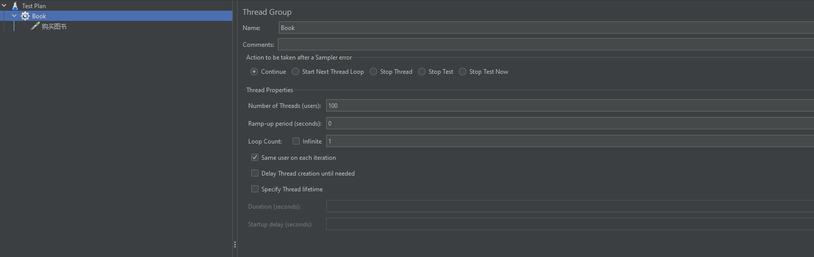
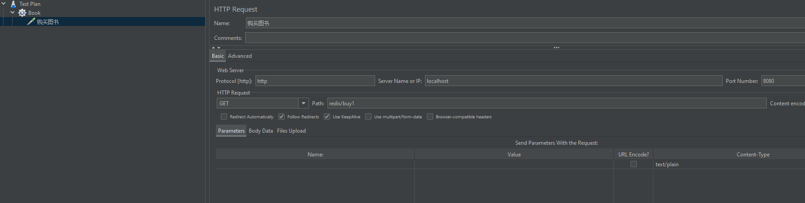
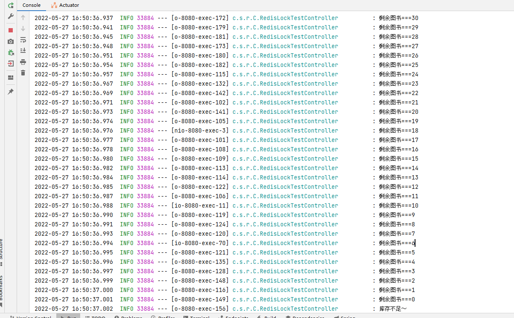

# Redis相关接口

### RedisLocktestController（分布式锁）
图书售卖时为了防止超卖的情况产生，在buy()方法中引入了redis分布式锁。
* 测试
 使用JMeter工具，设置线程

点击JMeter应用程序中工具栏中的绿色小三角即可执行，然后可以在IDEA控制台查看执行的结果

* 主要方法说明
1. lock()：会阻塞未获取锁的请求，默认持有30s锁，但当业务方法在30s内没有执行完时，会有看门狗（默认每隔10s）给当前锁续时30s。
2. tryLock()：尝试获取锁，获取不到则直接返回获取失败，默认持有30s锁，但当业务方法在30s内没有执行完时，会有看门狗（默认每隔10s）给当前锁续时30s。 
3. tryLock(long time, TimeUnit unit)：尝试获取锁，等待time TimeUnit，默认持有30s锁，但当业务方法在30s内没有执行完时，会有看门狗（默认每隔10s）给当前锁续时30s。 
4. tryLock(long waitTime, long leaseTime, TimeUnit unit)：尝试获取锁，等待waitTime TimeUnit，锁最长持有leaseTime TimeUnit，当业务方法在leaseTime TimeUnit时长内没有执行完时，会强制解锁。
